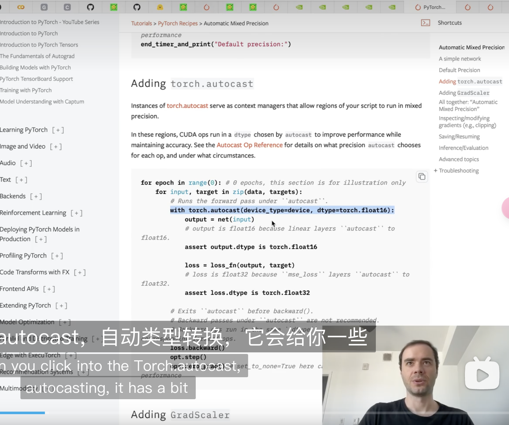
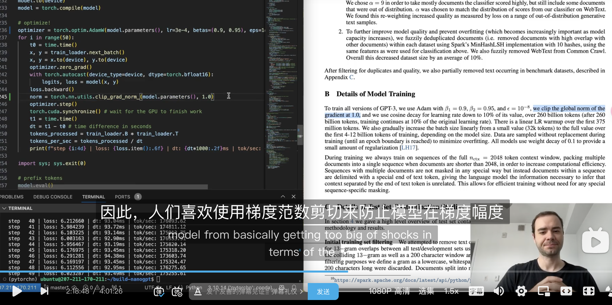

x
note

针对每一个commit记录笔记


## commit generate from the model
更新代码，使用tiktoken进行tokenization，对于gpt2模型，使用tiktoken.get_encoding('gpt2')即可获得对应的tokenizer，然后使用tokenizer.encode()方法进行编码，得到的结果是一个list，然后转换为tensor即可。

不断预测next token，选取topk=50，采样再彬姐到原本的序列上，直到达到最大长度。
```python
# prefix tokens
import tiktoken
enc = tiktoken.get_encoding('gpt2')
tokens = enc.encode("Hello, I'm a language model,")
tokens = torch.tensor(tokens, dtype=torch.long) # (8,)
tokens = tokens.unsqueeze(0).repeat(num_return_sequences, 1) # (5, 8)
x = tokens.to('cuda')
# generate! right now x is (B, T) where B = 5, T = 8
# set the seed to 42
torch.manual_seed(42)
torch.cuda.manual_seed(42)
while x.size(1) < max_length:
    # forward the model to get the logits
    with torch.no_grad():
        logits = model(x) # (B, T, vocab_size)
        # take the logits at the last position
        logits = logits[:, -1, :] # (B, vocab_size)
        # get the probabilities
        probs = F.softmax(logits, dim=-1)
        # do top-k sampling of 50 (huggingface pipeline default)
        # topk_probs here becomes (5, 50), topk_indices is (5, 50)
        topk_probs, topk_indices = torch.topk(probs, 50, dim=-1)
        # select a token from the top-k probabilities
        # note: multinomial does not demand the input to sum to 1
        ix = torch.multinomial(topk_probs, 1) # (B, 1)
        # gather the corresponding indices
        xcol = torch.gather(topk_indices, -1, ix) # (B, 1)
        # append to the sequence
        x = torch.cat((x, xcol), dim=1)
# print the generated text
for i in range(num_return_sequences):
    tokens = x[i, :max_length].tolist()
    decoded = enc.decode(tokens)
    print(">", decoded)
```


###  autodetect device, and switch to a random model
检测是否有cuda
```python
device = "cpu"
if torch.cuda.is_available():
    device = "cuda"
elif hasattr(torch.backends, "mps") and torch.backends.mps.is_available():
    device = "mps"
print(f"using device: {device}")
```


### implement gpt forward
在forward中，然后计算cross entropy loss，返回logits和loss。
并打印一个loss测试
```python
loss = None
if target is not None:
    loss = F.cross_entropy(logits.view(-1, logits.size(-1)), target.view(-1))
return logits, loss

```

### little loop crushes a little batch

load文件，在一个小的batch上进行训练，然后打印loss，体会训练过程
```python
optimizer = torch.optim.AdamW(model.parameters(), lr=3e-4)
for i in range(50):
    optimizer.zero_grad()
    logits, loss = model(x, y)
    loss.backward()
    optimizer.step()
    print(f"step {i}, loss: {loss.item()}")
```

```text
using device: cuda
step 0, loss: 10.926305770874023
step 1, loss: 6.574726581573486
step 2, loss: 4.240943431854248
step 3, loss: 2.620696544647217
step 4, loss: 1.5201581716537476
step 5, loss: 0.8466092348098755
```

### add a DataLoaderLite class
实现一个DataLoaderLite类，用于加载数据，每次返回一个batch。
注意x,y的实现方式，巧妙利用错位的方式实现。

```python
class DataLoaderLite:
    def next_batch(self):
        B, T = self.B, self.T
        # 注意x,y的实现方式，巧妙利用错位的方式实现。
        buf = self.tokens[self.current_position : self.current_position+B*T+1]
        x = (buf[:-1]).view(B, T) # inputs
        y = (buf[1:]).view(B, T) # targets
        # advance the position in the tensor
        self.current_position += B * T
        # 顺序读完整个语料，重新开始
        if self.current_position + (B * T + 1) > len(self.tokens):
            self.current_position = 0
        return x, y
```
```text
loaded 9627 tokens
1 epoch = 75 batches
step 0, loss: 10.887125015258789
step 1, loss: 9.66153621673584
step 2, loss: 8.721807479858398
step 3, loss: 9.031460762023926
step 4, loss: 8.504598617553711
step 5, loss: 8.149449348449707
step 6, loss: 8.97163200378418
```

### lm_head and wpe should share parameters 

实现共享权重，
为什么可以呢？：

wte是word embedding，wpe是position embedding，lm_head是最后的线性层，这里的transformer是gpt2模型，wte和wpe是gpt2的一部分，lm_head是我们自己加的，所以我们可以让lm_head和wte共享权重，这样就可以让lm_head和wte共享权重了。

同时共享参数后，相似的词语会有相似的embedding，这样可以提高模型的泛化能力。

好处：显著的减少参数量，这两部分参数量很大。
```python
        # weight sharing scheme
        self.transformer.wte.weight = self.lm_head.weight
```


### GPT-2 Initialization
初始化，设置bios = 0,在线性层放缩

正常使用哈维尔初始化 1/sqrt(d)的初始化方式. 而此处硬编码为0.02是合理的

缩放因子，控制残差流的增长方式。 n ** -0.5 (层数) 来控制std


```python

def _init_weights(self, module):
    if isinstance(module, nn.Linear):
        std = 0.02
        # scale initialization of weights for transformer
        if hasattr(module, 'NANOGPT_SCALE_INIT'):
            std *= (2 * self.config.n_layer) ** -0.5 
        torch.nn.init.normal_(module.weight, mean=0.0, std=std)
        if module.bias is not None:
            torch.nn.init.zeros_(module.bias)
    elif isinstance(module, nn.Embedding):
        # 硬编码为0.02 
        torch.nn.init.normal_(module.weight, mean=0.0, std=0.02)
```

这里的loss又回升了, 
```text
step 37, loss: 5.502460479736328
step 38, loss: 5.68325138092041
step 39, loss: 5.064756393432617
step 40, loss: 5.762222766876221
step 41, loss: 7.869300365447998
step 42, loss: 8.054488182067871
step 43, loss: 9.461557388305664
step 44, loss: 11.625313758850098
step 45, loss: 8.690959930419922
step 46, loss: 7.3267974853515625
step 47, loss: 7.999337196350098
step 48, loss: 8.160482406616211
step 49, loss: 7.6284027099609375
```

### add TensorFloat32 tf32 matmuls

使用tf32做乘法，8x free提升（实际三倍）
```python
torch.set_float32_matmul_precision('high')
```

加入了时间统计功能，计算每秒处理多少token，注意等待gpu处理完任务再计时

torch.cuda.synchronize() 


### add bfloat16
引入pytorch的autocast,对一些计算引入更小的精度，提高计算效率

```python 
    with torch.autocast(device_type=device, dtype=torch.bfloat16):
        logits, loss = model(x, y)
```

只在前向传播和loss计算使用bf16，而不是反向传播和梯度更新




### add torch  compile

torch.compile

kernel fusion,元素级别的操作合并到一起，减少内存往返。

但对attention计算却不适用
```python
model = torch.compile(model)
```
速度在我的机器上提升了2倍多，500ms/epoch ——228ms/epoch

 
### switch to  flash attention

不从不实际生成end2end的矩阵,

flash attention实际上提高了flops计算量，但却在计算上效率提高了7.6倍，主要原因是？

减少内存访问。在线更新softmax

1. 减少内存访问和I/O瓶颈:
   局部块处理（块化计算）：将输入分成较小的块并在块内完成计算，避免将中间结果（如完整的注意力矩阵）写回主存。
   减少中间结果存储：避免显式存储大规模的注意力矩阵，直接在计算过程中流式处理。
2. 数值稳定性优化: Flash Attention 使用一个流式、数值稳定的 softmax 实现，可以在不存储完整矩阵的情况下完成计算。
3. Flash Attention 对计算顺序进行了优化，使得计算密集型任务更贴近 GPU 的硬件特性
4. 常规的注意力计算通常需要多次访存，而 Flash Attention 对访存模式进行了优化，使数据访问更加连续，充分利用了 GPU 的内存带宽。


```python
y = F.scaled_dot_product_attention(q, k, v, is_causal=True) # flash attention
```

速度提升了近两倍， 228ms/epoch —— 144ms/epoch


### fix ugly number 

修改vocab到50304，符合2的幂次方，提高计算效率。 利用部分没利用了核

144ms /epoch —— 136ms/epoch， 提升了5%左右


### AdamW params and grad clipping set
学习部分gpt3的参数设置

```python
optimizer = torch.optim.AdamW(model.parameters(), lr=3e-4, betas=(0.9, 0.95), eps=1e-8)
 norm = torch.nn.utils.clip_grad_norm_(model.parameters(), 1.0)
```

梯度裁剪，防止某bach的梯度过大，导致模型不稳定。 shock your  model




### add learning rate scheduler
引入cosine learning rate scheduler，学习率调度器，调整学习率，使得模型更快收敛. 学习gpt3的设置
```python
 lr = get_lr(step)
    for param_group in optimizer.param_groups:
        param_group['lr'] = lr
    optimizer.step()
```

### add weight decay, only for 2D params, and add fused AdamW

引入权重衰减，只对2D参数进行衰减，不对bias进行衰减，因为bias是一个偏置项，不需要进行衰减。

检查是否有fused AdamW，如果有则使用，否则使用普通的AdamW。 可以减少内存往返，提高计算效率。
```python
optim_groups = [
{'params': decay_params, 'weight_decay': weight_decay},
{'params': nodecay_params, 'weight_decay': 0.0}
]
num_decay_params = sum(p.numel() for p in decay_params)
num_nodecay_params = sum(p.numel() for p in nodecay_params)
        
        
fused_available = 'fused' in inspect.signature(torch.optim.AdamW).parameters
        use_fused = fused_available and 'cuda' in device
```


### add gradient accumulation

梯度累积，将梯度累积到多个batch上，然后再更新参数，可以减少内存占用，提高计算效率。

也要注意梯度累积的时候，梯度要除以累积的次数，normalize一下
```python
grad_accum_steps = total_batch_size // (B * T)

   for micro_step in range(grad_accum_steps):
        x, y = train_loader.next_batch()
        with torch.autocast(device_type=device, dtype=torch.bfloat16):
            logits, loss = model(x, y)
        loss = loss / grad_accum_steps
        loss_accum += loss.detach()
        loss.backward()
   optimizer.step()
```
```text
1 epoch = 20 batches
num decayed parameter tensors: 50, with 124,354,560 parameters
num non-decayed parameter tensors: 98, with 121,344 parameters
using fused AdamW: True
step    0 | loss: 11.044553 | lr 6.0000e-05 | norm: 26.9359 | dt: 21725.70ms | tok/sec: 24132.16
step    1 | loss: 9.702580 | lr 1.2000e-04 | norm: 11.1244 | dt: 3980.83ms | tok/sec: 131703.12
step    2 | loss: 9.301566 | lr 1.8000e-04 | norm: 6.5375 | dt: 3975.35ms | tok/sec: 131884.87
step    3 | loss: 9.718234 | lr 2.4000e-04 | norm: 6.7101 | dt: 3976.64ms | tok/sec: 131842.06
step    4 | loss: 9.110813 | lr 3.0000e-04 | norm: 4.0629 | dt: 3972.49ms | tok/sec: 131979.70
step    5 | loss: 8.656642 | lr 3.6000e-04 | norm: 3.3112 | dt: 3971.69ms | tok/sec: 132006.28
step    6 | loss: 8.345835 | lr 4.2000e-04 | norm: 2.2803 | dt: 3975.11ms | tok/sec

step   46 | loss: 5.769111 | lr 7.3215e-05 | norm: 0.2178 | dt: 4139.32ms | tok/sec: 126660.56
step   47 | loss: 5.787341 | lr 6.7460e-05 | norm: 0.2236 | dt: 4145.94ms | tok/sec: 126458.27
step   48 | loss: 5.760652 | lr 6.3324e-05 | norm: 0.1935 | dt: 4144.67ms | tok/sec: 126497.05
step   49 | loss: 5.759069 | lr 6.0832e-05 | norm: 0.2130 | dt: 4147.71ms | tok/sec: 126404.36
```


### add DistributedDataParallel training

[-]  大概需要重看ddp的部分再次理解，优化的部分是如何多gpu进行的梯度累积 

master—node 打印必要信息

在dataloader中，让对应的rank 进程读取对应的数据。
不过多卡并行的得到的数据和单卡是“不完全相同”的，导致loss的结果略有不同

多卡并行导致数据要分发。

DDP的基本设置

torchrun --standalone --nproc_per_node=2 train_gpt2.py
```python

# run the training loop
from torch.distributed import init_process_group, destroy_process_group
from torch.nn.parallel import DistributedDataParallel as DDP
import torch.distributed as dist
# set up DDP (distributed data parallel).
# torchrun command sets the env variables RANK, LOCAL_RANK, and WORLD_SIZE
ddp = int(os.environ.get('RANK', -1)) != -1 # is this a ddp run?
if ddp:
    # use of DDP atm demands CUDA, we set the device appropriately according to rank
    assert torch.cuda.is_available(), "for now i think we need CUDA for DDP"
    init_process_group(backend='nccl')
    ddp_rank = int(os.environ['RANK'])
    ddp_local_rank = int(os.environ['LOCAL_RANK'])
    ddp_world_size = int(os.environ['WORLD_SIZE'])
    device = f'cuda:{ddp_local_rank}'
    torch.cuda.set_device(device)
    master_process = ddp_rank == 0 # this process will do logging, checkpointing etc.
else:
    # vanilla, non-DDP run
    ddp_rank = 0
    ddp_local_rank = 0
    ddp_world_size = 1
    master_process = True
    # attempt to autodetect device
    device = "cpu"
    if torch.cuda.is_available():
        device = "cuda"
    elif hasattr(torch.backends, "mps") and torch.backends.mps.is_available():
        device = "mps"
    print(f"using device: {device}")
```

注意这里的model和raw_model的区别，model是DDP的模型，raw_model是原始的模型，因为DDP的模型是一个包装过的模型，所以要使用model.module来获取原始的模型。
```python
if ddp:
    model = DDP(model, device_ids=[ddp_local_rank])
raw_model = model.module if ddp else model
```

让 梯度在mini step中先不同步，在最后再同步，这样可以提高计算效率

最后把loss在所有进程中求平均，得到最终的loss（必要，jupyter有实验）
```python
for step in range(max_steps):
    t0 = time.time()
        # instead of a SUM we want MEAN. Scale the loss here so it comes out right
        loss = loss / grad_accum_steps
        loss_accum += loss.detach()
        if ddp:
            model.require_backward_grad_sync = (micro_step == grad_accum_steps - 1)
        loss.backward()
    if ddp:
        dist.all_reduce(loss_accum, op=dist.ReduceOp.AVG)
```